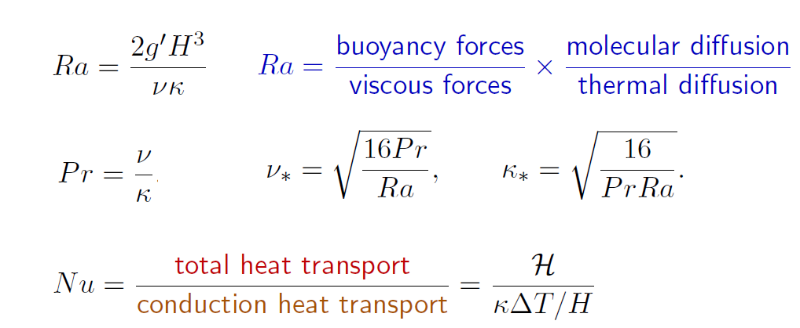
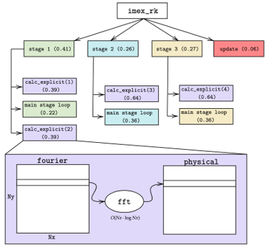
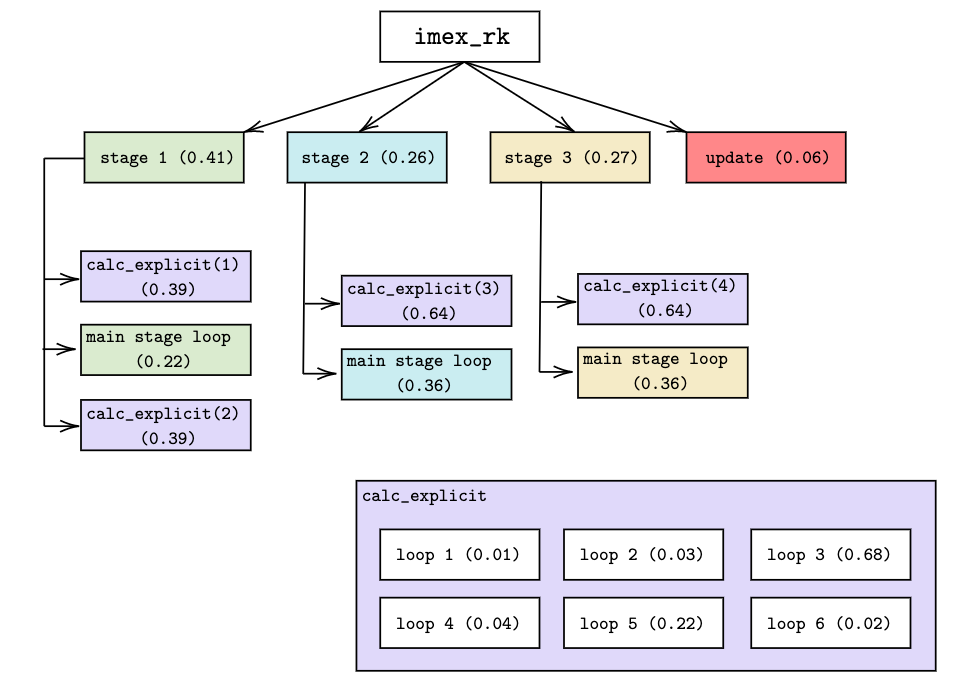
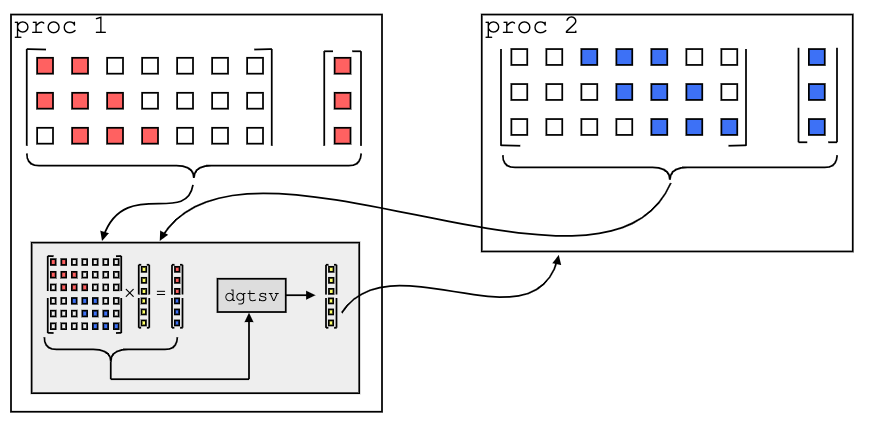
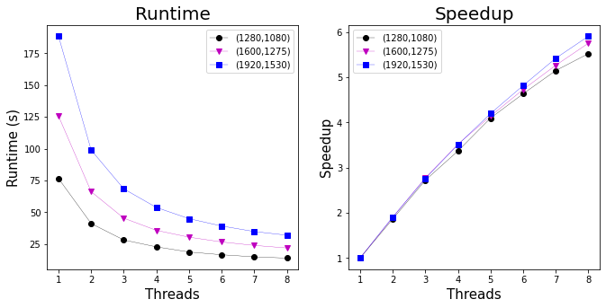
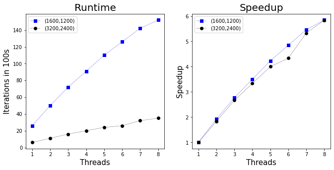
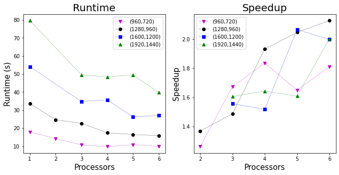
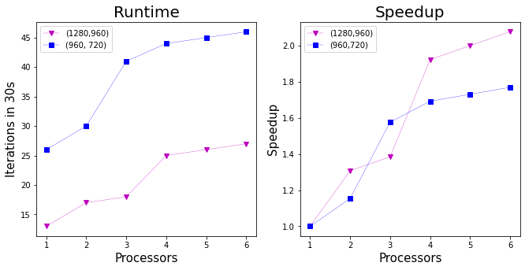
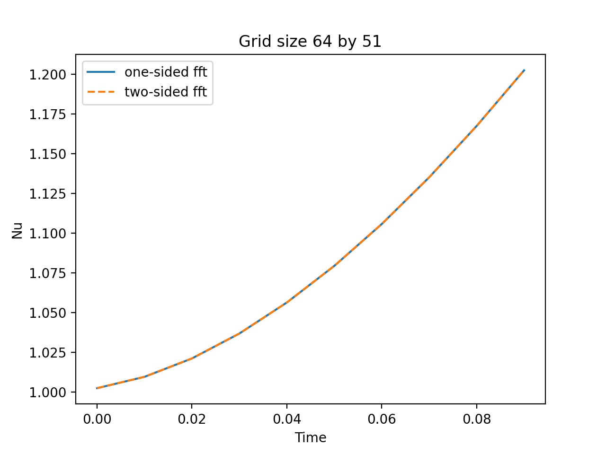
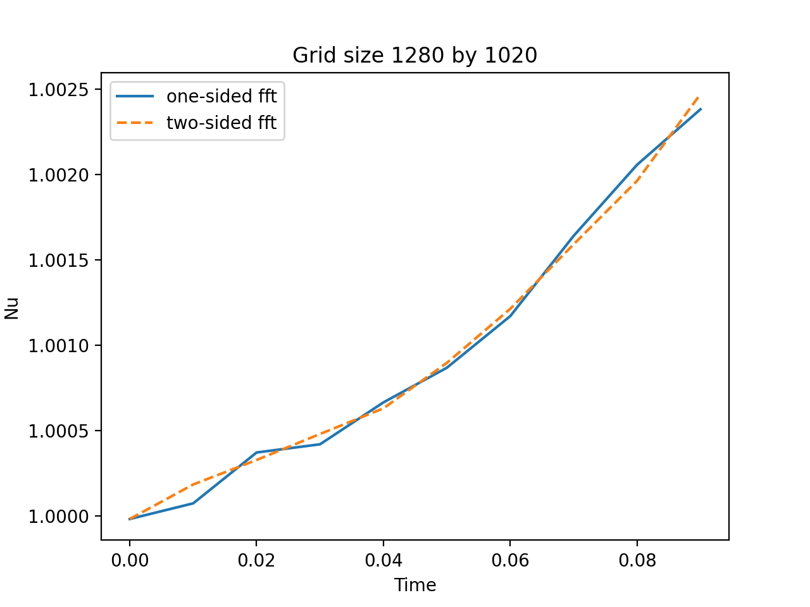

# Optimal Solutions in Rayleigh-Benard Convection: Parallel Implementation

This `parallel_project` branch captures the results of a semester long project in Harvard's CS205: Computing Foundations for Computational Science. The primary goal was to modify the time integration to run in parallel.  The code base and inspiration for the project came from Sondak et al., of the paper below [[1]](#1). Team Members: Katrina Gonzalez, Michael Neuder, Jack Scudder

The sections of this README are organized as follows:
1. [Problem Description and Need for HPC](README.md#1-problem-description-and-need-for-hpc)
2. [Description of Solution and Comparison to Existing Work](README.md#2-description-of-solution-and-comparison-to-existing-work)
3. [Technical Details of Parallel Design](README.md#3-technical-details-of-parallel-design)
4. [Source Code](README.md#4-source-code)
5. [Technical Description of Code](README.md#5-technical-description-of-code)
6. [Performance Evaluation](README.md#6-performance-evaluation)
7. [Advanced Features](README.md#7-advanced-features)
8. [Discussion and Future Work](README.md#8-discussion-and-future-work)
9. [References](README.md#9-references)

A directory structure can be found in [Section 4](README.md#4-source-code).

Our final project presentation slides are located [here](https://github.com/dsondak/optRBC/blob/parallel_project/cs205_project_final_presentation.pdf).


## 1. Problem Description and Need for HPC
*Description of problem and the need for HPC and/or Big Data*

### 1.1 Model Description in Detail
*Description of your model and/or data in detail: where did it come from, how did you acquire it, what does it mean, etc.*

Rayleigh-Benard convection (RBC) is phenomena that takes place when a liquid is placed between two (approximately) infinite plates held at some temperature difference. When the bottom plate is kept at a higher temperature than the top plate, this creates competing buoyancy and gravitational effects.  A simple and complex example are below.


The temperature flow of this liquid can be described by the Oberbeck-Boussinesq partial differential equations. These PDEs can be solved at each location and time step to numerically compute the temperature field and its evolution. The non-dimensional parameters we are primarily focused on are listed with descriptions below:
- Rayleigh Number (Ra) is a measure of convection. 
- Prandtl Number (Pr) is a measure of viscosity (eg. Pr=7 for water, Pr=98.31 for engine oil). 
- Nusselt Number (Nu) is a ratio of convective to conductive heat transfer. 


 \* adapted from a presentation based on the paper in [[1]](#1).

The low Rayleigh number regime in RBC has been studied extensively; therefore, this code was written to simulate problems with high Rayleigh numbers.  Though Rayleigh-Benard convection is a physical and therefore 3D problem, this particular code implements 2D Rayleigh-Benard convection.  This simplification reduces the complexity of the algorithm, allowing for exploration of the ratio between Nu and Ra at high values of Ra up to 10^9. 

### 1.2 Need for HPC
At high Ra numbers the discretized mesh is finer, and therefore it is more computationally intensive to run the simulation.  In order to simulate high Ra numbers more quickly, we sought to parallelize the existing code using OpenMP and MPI, and we explored Fast Fourier Transform (FFT) methods to improve algorithmic efficiency.  (*Note*: our particular FFT implementation is FFTW3 [[2]](#2).  We use FFT and FFTW interchangeably to reference the same calculations.)  The serial version of the current algorithm has a time complexity of O(Nt * Ny * Nx * log(Nx)), where Nt is the number of time steps, Nx is the number of x points in the mesh and Ny is the number of y points in the mesh.
This leads to exceedingly long computation times at large problem sizes and long integration runs.  Since this is a compute-intensive code designed to solve complex PDEs, it is a High Performance Computing (HPC) problem.


## 2. Description of Solution and Comparison to Existing Work
*Description of solution and comparison with existing work on the problem*

Using the Fortran code base from Sondak et al. [[1]](#1), we initially profiled the serial code to determine the primary bottlenecks of the `time_integrators.f90` portion.  In each time step, the code performs updates using an implicit-explicit Runge-Kutta method detailed in [[3]](#3).  In the code, the `imex_rk()` subroutine computes 8*Ny Fast Fourier Transforms per time step, each of which costs O(Nx * log(Nx)) computational time.  Details of the code profiling are shown below.



Values in parenthesis are the percentage of that parent subroutine's runtime spent on the boxed subroutine.  The subroutine `calc_explicit` performs the FFT calculations and is the clear bottleneck of the code.  Looking at this profile helped us identify our three-step approach to parallelization: (1) use OpenMP to parallelize loops at each time step, (2) use MPI to distribute calculations across multiple nodes, and (3) explore FFTW modifications to leverage multithreading capabilities or reduce computation time by using a one-sided FFT.

As previously stated, our primary project comparison is to the base code from Sondak et al. [[1]](#1).  The endstate of our code is the same as the original: to calculate optimal solutions in RBC.  We merely sought to make the process more efficient through parallelization.  One particular paper by Clarke et al. (2020) [[4]](#4) sought to parallelize the same problem set.  They applied the same discretization using the Boussinesq approximation to the Navier-Stokes equations for a 2D RBC simulation, but used the Parareal algorithm.  They claimed to achieve speedups of up to 2.4 "with around 20 processors \[...\] for Rayleigh numbers as high as 10^6."  Their code wasn't shared; however, so we were not able to directly compare their implementation with ours.  Additionally, it was both helpful and educational to experiment with Fortran without having to create this robust simulation from scratch.


## 3. Technical Details of Parallel Design
*Technical description of the parallel application, programming models, platform and infrastructure*

### 3.1 Parallel Application
As stated in [Section 1](README.md#1-problem-description-and-need-for-hpc), this is a High Performance Computing problem.  The original implementation was completely serial, and with a time complexity of O(Nt * Nx * Ny * log(N)), it requires a large amount of computing power to achieve its goal of simulating RBC at high Ra.  Our design uses both fine-grained (OpenMP) parallelism at the loop and procedure level, and coarse-grained parallelism (MPI) at the task level discretization at scale.  The types of parallelism match those levels, with OpenMP allowing us to employ function/control parallelism, and MPI allowing us to apply data parallelism.  In our MPI implementation, we make use of the Single Program-Multiple Data (SPMD) as we pass large amount of data between nodes.

### 3.2 Programming Models
Our design uses both shared memory parallelism (OpenMP) and distributed memory parallelism (MPI).  While we originally intended to create a distributed MPI implementation, we realized that an important part of the serial code relies on the Basic Linear Algebra Subprograms (BLAS) routine that solves tridiagonal matrices. Further information is provided in [Section 5.1](README.md#51-software-design), but the final version of the code MPI implementation serializes these 
tridiagonal solves. Additionally, the final MPI version can be run with OpenMP to create a hybrid version of the code. More details are presented in [Section 5.1](README.md#51-software-design).

Along with introducing different levels of parallelism, we also sought to introduce some speedup with enhancements like multithreaded FFT and one-sided FFT. To explore multithreaded FFT (which is included in the FFTW library), we wrote a test script in which we compared the timing of multithreaded FFT against single threaded FFT. We found that over both thread and array size, there was no meaningful speedup observed, or there was actually a degradation in performance.

With respect to one-sided FFT, we experimented with more strongly typing certain arrays as real (as physical fields are real) and using Hermitian conjugacy (when computing the Fourier Transform of a size N array, only N/2 + 1 of those elements are not redundant). In particular, this change involved modifying array types, array sizes, and certain loops meant to be executed in Fourier space. Subroutines swapped out include planning and execution, with the strictly real to complex or complex to real transformations included in the FFTW library. Due to Hermitian conjugacy, we expected a theoretical speedup of 2x for each Fourier transform (originally Nx*log(Nx)), along with additional 2x speedups for Nx loops in Fourier space. 

### 3.3 Platform and Infrastructure
We used an Amazon Web Services (AWS) t2.2xlarge instance with the Ubuntu 18.04 operating system for our evaluation and performance criteria.  Further details are included in [Section 5.4](./README.md#54-replicability-information) and the [examples directory](https://github.com/dsondak/optRBC/tree/parallel_project/examples) README.

We planned to use to the FAS RC academic cluster to run our experiments, but ran into several challenges, two of which are captured here.  First, the results were inconsistent depending on the day of the week and the time of day.  Despite using the Slurm commands introduced on the FAS RC documentation and in class, the results were still inconsistent.  This was likely due to a high degree of device sharing between jobs, introducing variability with respect to how much of the machine we could use.  Second, the performance of our code on AWS was consistent and also yielded significantly higher speedups.  Running the OpenMP version of our code, at Nx= 1280, Ny=1080, Ra=5000 yielded a 6x speedup on an AWS instance with 8 threads.  Running the same version on the cluster yielded a ~4.5x speedup.  These results caused us to switch focus to AWS and abandon using the cluster for performance results. 


## 4. Source Code
*Links to repository with source code, evaluation data sets and test cases*

The overall directory structure of the `parallel_project` branch is as follows, with shell scripts used to run examples, our final presentation slides, and two READMEs called out specifically: 
```
optRBC/parallel_project/
|--- cs205_project_final_presentation.pdf
|--- README.md (full project description)
|--- examples/
    |--- README.md (specific to examples and test cases)
    |--- run_hybrid.sh
    |--- run_mpi_strong.sh
    |--- run_mpi_weak.sh
    |--- run_nusselt.sh
    |--- run_omp_strong.sh
    |--- run_omp_weak.sh
    |--- run_temp_viz.sh
    |--- fft_examples/
         |--- run_fft_one_side.sh
         |--- run_multithread_fft.sh
|--- figs/
```
Included on this `parallel_project` branch are the OpenMP and MPI implementations of the time integration step listed below:
- OpenMP:  `time_integrators.f90` and driver code `time_loop.f90`
- MPI: `time_integrators_MPI.f90` and driver code `time_loop_MPI.f90`

Modifications were made to several other files, but the majority of changes are found in those files.  FFTW modifications for one-sided computations are found on the [real_to_comp](https://github.com/dsondak/optRBC/tree/real_to_comp) branch. Changes to implement one-sided FFT have been kept on that branch because the code modifications touch several different files. Additionally, there is an active bug in the one-sided code in which the Nusselt number is inconsistent between one-sided and two-sided calculations at large grid sizes (on the order of ~1000 elements in Nx and Ny). Examples for benchmarking one-sided FFT and multithreaded FFT are found in [fft examples directory](https://github.com/dsondak/optRBC/tree/parallel_project/examples/fft_examples). 

Detailed examples and performance evaluation test cases can be found in the [examples directory](https://github.com/dsondak/optRBC/tree/parallel_project/examples).  The `README` in that directory gives stepwise instructions to compile, run, and replicate our results. 


## 5. Technical Description of Code
*Technical description of the software design, code baseline, dependencies, how to use the code, and system and environment needed to reproduce your tests*
### 5.1 Software Design
#### 5.1.1 Code Baseline
The existing code base implemented the implicit-explicit Runge-Kutta method to solve the Oberbeck-Boussinesq partial differential equations. The code 
that we worked with was the executable generated by [time_loop.f90](./time_loop.f90). The following outline highlights the main components and subroutines 
of the program. We describe the components of the baseline code to be able to clearly describe where we made changes and added parallelization and optimization. This is mostly a reference used in the description of our OpenMP and MPI implementations, so the reader is encouraged to move ahead to the summary and profile diagram below the list if they are so inclined.

1. [time_loop.f90, line 36](./time_loop.f90#L36) - reads in the `input.data` file to determine configuration of the integration.
2. [time_loop.f90, line 237](./time_loop.f90#L237) - calls to 3 subroutines to set up the mesh: `cosine_mesh`, `dxdydz`, and `y_mesh_params`. These subroutines are defined in the [mesh_pack.f90](./mesh_pack.f90) file.
3. [time_loop.f90, line 357](./time_loop.f90#L357) - call to the `imex_rk` subroutine which is defined in the [time_integrators.f90](./time_integrators.f90) file. This is the call to the implicit-explicit RK solver. Everything up to this point is just initialization, and the main work of the program is fully contained in `imex_rk`.
4. [time_integrators.f90, line 56](./time_integrators.f90#L56) - call to the `init_bc` subroutine which is defined in the [bc_setup.f90](./bc_setup.f90) file. This subroutine initializes the boundary conditions of the matrices.
5. [time_integrators.f90, line 79](./time_integrators.f90#L79) - the beginning of the time integration `do` loop. This loop is the main work done in the program, but cannot be parallelized because each time depends on the state of the system at the previous time.
6. [time_integrators.f90, line 102](./time_integrators.f90#L102) - first call to the `calc_explicit` subroutine, which is defined on [line 620](./time_integrators.f90#L620). `calc_explicit` is the main bottleneck of the code. It computes the values the `Khat` variables, which are used to update the solutions to the temperature and derivative fields. The subroutine consists of six loops: 
    * Loop 1: update Khat_phi (loop specified by a switch statement on the stage number).
    * Loop 2: calculate the derivatives in fourier space.
    * Loop 3: executes the ffts to transform everything from fourier space to physical space (this is by far the most time-consuming loop)
    * Loop 4: update the non-linear terms of the solution. 
    * Loop 5: executes ffts to bring non-linear terms back into fourier space.
    * Loop 6: update Khat_T (loop specified by a switch statement on the stage number).
7. [time_integrators.f90, line 107](./time_integrators.f90#L107) - stage 1 `do` loop. This is the first of 3 main stage loops, each of which iterate of the columns of the variables. Each stage loop is very similar in structure, and the loops calculate the values of the `K` variables, which are used to update the solutions. 
    * [line 109](./time_integrators.f90#L109): call to `calc_vari_mod` subroutine, which is defined on [line 438](./time_integrators.f90#L438). This subroutine calculates the temperature and phi fields at the first stage by solving a tridiagonal system based on the derivatives. An example of the tridiagonal solve is at [line 518](./time_integrators.f90#L518), where `dgtsv` is called (which is a LAPACK subroutine). The `calc_vari_mod` function uses different systems depending on what stage it was called in.   
    * [line 117](./time_integrators.f90#L117) call to `calc_vi_mod` subroutine, which is defined on [line 825](./time_integrators.f90#L825). This subroutine also solves a tridiagonal system, but this time to calculate the velocity field. 
    * [line 123](./time_integrators.f90#L123) call to `update_bcs_mod` subroutine, which is defined on [line 918](./time_integrators.f90#L918). This subroutine updates the boundary conditions of the phi and uy fields.
    * [line 129](./time_integrators.f90#L129) call to `calc_implicit_mod` subroutine, which is defined on [line 602](./time_integrators.f90#L602). This subroutine calculates the correct values of Kphi and KT, which will be written to the stage specific versions of those variables.
    * [lines 139-141](./time_integrators.f90#L139) updates to the phii, Ti, and uyi fields. These updates will be used to calculate the next explicit updates.
8. [time_integrators.f90, line 148](./time_integrators.f90#L148) - second call to `calc_explicit`. This is the exact same as the previous call, but with stage 2 specified for Loops 1 and 6. See item number 6 above for more granular details.
9. [time_integrators.f90, line 157](./time_integrators.f90#L157) - stage 2 `do` loop. The same functions as in the stage 1 `do` loop are called, just with stage 2 parameters. See item number 7 above for more granular details.
10. [time_integrators.f90, line 192](./time_integrators.f90#L192) - third call to `calc_explicit`. This is the exact same as the previous call, but with stage 3 specified for Loops 1 and 6. See item number 6 above for more granular details.
11. [time_integrators.f90, line 201](./time_integrators.f90#L201) - stage 3 `do` loop. The same functions as in the stage 1 `do` loop are called, just with stage 3 parameters. See item number 7 above for more granular details.
12. [time_integrators.f90, line 237](./time_integrators.f90#L237) - fourth and final call to `calc_explicit`. This is the exact same as the previous call, but with stage 4 specified for Loops 1 and 6. See item number 6 above for more granular details.
13. [time_integrators.f90, line 245](./time_integrators.f90#L245) - the actual update of the T and phi fields, using the K and Khat variables calculated over the last 3 stages of the implicit-explicit method. 
14. [time_integrators.f90, line 256](./time_integrators.f90#L256) - `do` loop to calculate the derivative fields ux and uy at the current time step.
15. [time_integrators.f90, line 288](./time_integrators.f90#L288) - if the vtk files are being written, the `write_to_vtk` function is called. This is defined in the [write_pack.f90](./write_pack.f90) file.  

##### Summary
The above list is very detailed, but overall we can describe what is happening at a high level in the `imex_rk` function. For each time step, there are four matrices that need to be updated `T, phi, ux, uy`. In order to update `T` and `phi`, the 12 variables below need to be calculated (each of which is an (Ny,Nx) matrix)

* `K1_phi, K2_phi, K3_phi`
* `K1hat_phi, K2hat_phi, K3hat_phi, K4hat_phi`
* `K1_T, K2_T, K3_T`
* `K1hat_T, K2hat_T, K3hat_T, K4hat_T`

These variables make up the pieces of the Runge-Kutta method. There are 3 stages of the code. The main stage loops (items 7,9,11 above) calculate the K variables,
and the calls to `calc_explicit` subroutine (items 6,8,10,12 above) calculate the Khat variables.

#### Profile
Now that we have a description of what the baseline code actually does, we can show a profile we created to highlight the performance of each component of the 
code. 



In the figure above we breakdown the components of the `imex_rk` function. Each rectangle represents a chunk of code or a subroutine, and the parenthetical numbers indicate the proportion of the time at that depth that was spent on that piece. For example, at a depth of 1, we break the runtime down into four pieces: (1) stage 1, (2) stage 2, (3) stage 3, (4) update. These portions take up 41%, 26%, 27%, and 6% of the runtime respectively, which totals to 100%. From this figure it is clear that the four `calc_explicit` calls consume a majority of the total runtime, which is why we break down the `calc_explicit` subroutine into 6 loops to highlight that loops 3 and 5 consume a majority of that runtime. These two loops execute the fast fourier transforms. 

#### 5.1.2 OpenMP Implementation
Now that we understand the code organization and profile of the baseline code, we can present the changes required to implement the OpenMP version. Overall there were 16 loops that we were able to parallelize with the `!$OMP PARALLEL DO` compiler directive.

* 12 loops in the `calc_explicit` subroutine, which is defined in [time_integrators.f90, line 620](./time_integrators.f90#L620). 
    * 4 loops (one for each stage) described by Loop 1 in item 6 of the code description. 
    * 4 loops presented as Loops 2-5 in item 5 of the code description.
    * 4 loops (one for each stage) described by Loop 6 in item 6 of the code description. 
* 3 loops (one for each stage), which are described in items 7,9,11 of the code description.
* 1 loop, the update solutions loop, which is described in item 14 of the code description. 

##### Subroutines and the interaction of shared and private variables. 
The most complex part of parallelizing the loops described above was understanding how FORTRAN handles shared and private variables within the parallel sections of the code. The rules are as follows:
1. In a `PARALLEL DO` section, the iteration variable is by default `private`.
2. All other variables accessed directly inside that do loop are by default `shared`. 
3. All variables accessed in subroutines are `private`.

Because of these rules, the main stage loops and the update solutions loop could not simply be surrounded by the compiler directives. The reason for this is that those loops call subroutines which access global variables. Since the variables within the subroutine are all `private` by default, the global variables will be in an undetermined state when they are called. Additionally, it is not possible to simply define these variables as `shared` in the compiler directive, because the OMP compiler will only allow scoping of variables that are directly accessed in the scope of the `do` loop, and since the globals are accessed within the subroutine, they are not visible and thus will throw a compiler error. The workaround we came up with to deal with this was to inject the global variables as arguments into the subroutines that accessed them. By doing this, the globals became visible in the scope of the `do` loop and thus we shared by default in accordance with rule 2 above. This global variable injection required refactoring the subroutine interfaces to take many more arguments than were previously required. As an example, we can consider the `calc_vari` subroutine. Before we changed the interface, it was defined by 

```
subroutine calc_vari(phiout,Tout, aii, stage)
```

For the OpenMP version of this function, the signature becomes 

```
subroutine calc_vari_mod(phiout,Tout, aii, stage, kx_it, phi_in, &
                         k1hat_phi_in, k2hat_phi_in, k3hat_phi_in,&
                         k1hat_T_in, k2hat_T_in, k3hat_T_in,&
                         k1_phi_in, k2_phi_in, k1_T_in, k2_T_in,&
                         T_in)
```                

where `phi_in,k1hat_phi_in, k2hat_phi_in, k3hat_phi_in,k1hat_T_in, k2hat_T_in, k3hat_T_in,k1_phi_in, k2_phi_in, k1_T_in, k2_T_in,T_in`
are global variables accessed within the `calc_vari` function. The call site of the 
function changes from 

```
call calc_vari_mod(tmp_phi, tmp_T, acoeffs(1,1), 1)
```

to 

```
call calc_vari_mod(tmp_phi, tmp_T, acoeffs(1,1), 1,&
                   kx(it), phi(2:Ny-1,it),&
                   K1hat_phi(2:Ny-1,it),K2hat_phi(2:Ny-1,it),K3hat_phi(2:Ny-1,it),&
                   K1hat_T(2:Ny-1,it),K2hat_T(2:Ny-1,it),K3hat_T(2:Ny-1,it),&
                   K1_phi(2:Ny-1,it), K2_phi(2:Ny-1,it), K1_T(2:Ny-1,it), K2_T(2:Ny-1,it),&
                   T(:,it))
```

We had to do this process for the four functions listed below.

1. `calc_vari` [line 308](./time_integrators.f90#L308) changed to `calc_vari_mod` [line 438](./time_integrators.f90#L438)
2. `calc_vi` [line 778](./time_integrators.f90#L778) changed to `calc_vi_mod` [line 825](./time_integrators.f90#L825)
3. `calc_implicit` [line 585](./time_integrators.f90#L585) changed to `calc_implicit_mod` [line 602](./time_integrators.f90#L602)
4. `update_bcs` [line 873](./time_integrators.f90#L873) changed to `update_bcs_mod` [line 918](./time_integrators.f90#L918)

With this in place, all the 16 loops described above could be parallelized! [Section 6](README.md#6-performance-evaluation) describes the performance of this version of the code. 

#### 5.1.3 MPI Implementation

We also implemented an MPI version of the code. Since this required a larger scale refactor to move from a shared memory setting to a distributed memory setting, we split the MPI version from the OpenMP version and created two new files [time_loop_MPI.f90](./time_loop_MPI.f90) and [time_integrators_MPI.f90](./time_integrators_MPI.f90). Additionally, we created a new executable called `time_loop_MPI.exe` which is defined in the [Makefile, line 16](./Makefile#L16). The MPI implementation required many changes, which we describe below. All of the changes rely on using the process id, retrieved in the `call MPI_Comm_rank(MPI_COMM_WORLD, proc_id, mpierror)` and the number of processes, retrieved in the `call MPI_Comm_size(MPI_COMM_WORLD, num_procs, mpierror)`. The MPI
initialization takes place at [lines 46-48](./time_loop_MPI.f90#L46)

##### Initialization

This code relies on many global matrices to keep track of the updates to the variables as the time integration progresses. In a distributed memory setting, we had to change many of the initialization subroutines. These are described in following list.

1. `cosine_mesh` [line 8, mesh_pack.f90](./mesh_pack.f90#L8) changed to `cosine_mesh_MPI` [line 47, mesh_pack.f90](./mesh_pack.f90#L47)
This function initializes the mesh grid used for the integration. This is a non-uniform grid.
The MPI version of the function uses its process and the number of total processes to determine 
the grid locations. This function refers to item 2 of the code description.
2. `dxdydz` [line 91, mesh_pack.f90](./mesh_pack.f90#L91) changed to `dxdydz_MPI` [line 118, mesh_pack.f90](./mesh_pack.f90#L118)
This function calculates the y spacing for the grid. The MPI version requires sending 
and receiving of boundary values to calculate spacing at the edge of the grid. This function refers to item 2 of the code description.
3. `y_mesh_params` [line 167, mesh_pack.f90](./mesh_pack.f90#L167) changed to `y_mesh_params_MPI` [line 199, mesh_pack.f90](./mesh_pack.f90#L199)
This function calculates the metric coefficients for the first and second derivative. The MPI version
requires sending boundary values to calculate boundaries. This function refers to item 2 of the code description.
4. `init_bc` [line 12, bc_setup.f90](./bc_setup.f90#L12) changed to `init_bc_MPI` [line 148, bc_setup.f90](./bc_setup.f90#L148)
This function initializes the boundary conditions. The MPI version of the function uses its process and the number of total processes to determine if it is at the boundary. This function refers to item 4 of the code description.
5. [line 96](./time_integrators_MPI.f90#L96) is the start of an important set of initializations, where the main node, identified by having the process id of 0, initializes many of the global variables that it will need access to. This involves receiving many pieces of data from the other nodes. 

##### Time loop

With the above code, the global variables are properly initialized in a distributed manner across the processes. Now we get to the main time loop portion of the code, which starts at [line 158, time_integrators_MPI.f90](./time_integrators_MPI.f90#L158). First, we had to write an MPI version of `calc_explicit`, which is called `calc_explicit_MPI` and is defined at [line 924](./time_integrators_MPI.f90#L924). This subroutine is very similar to `calc_explicit` described in the OpenMP version and in the code description item 6, with a few minor changes. In particular, loops 2 and 4 can no longer be parallelized with OpenMP because they call the `d1y_MPI2` and `d2y_MPI2` functions, which require sending and receiving messages. Sending and receiving messages on multiple threads is difficult because you don't know which thread will be expecting or sending the messages. As a result, only loops 1,3,5,6 of `calc_explicit_MPI` are parallelized with OpenMP. Now we are to the main stage loops of the MPI version (item 7,9,11) of the code description. 

##### Tridiagonal solves
The main stage loops were the most difficult portion of the MPI implementation. The complications arise from the fact that `calc_vari_mod` and `calc_vi_mod` (as described in the OpenMP section above), solve a tridiagonal matrix equation. That is, they solve `Ax=b` where `A` is a square, tridiagonal matrix of size `(Ny-2,Ny-2)`. In a distributed memory setting, each node has a portion of the matrix `A` and the solution vector `b`.
Since the matrix is split along the y-direction, each node has an overdetermined system, which has infinite solutions. While it is possible to solve the 
tridiagonal system entirely in parallel, (see [[5]](#5) or https://web.alcf.anl.gov/~zippy/publications/partrid/partrid.html for example), this was out of scope to implement
in the remaining time we had in the semester. To workaround this issue, we had each process send their portion of the matrix `A` and the solution vector `b` to the main node, which executed the tridiagonal solves and returned the solutions to the auxiliary nodes. This is essentially serializing this portion of the code. The figure below demonstrates this process.



In this figure, a 2 process MPI run is demonstrated. Each process has half of the matrix and the solution vector, which is shown by the red and blue square respectively. Process 2 sends its data to Process 1, who combines it with their own to get the whole system. Process 1 executes the `dgtsv` function which solves the tridiagonal system, and then the second half of the solution vector
is sent back to Process 2. In the code, we see that on [line 189](./time_integrators_MPI.f90#L189), the process with `proc_id==0` is used to be the main node. Within that conditional block, the process collects all the global variables needed to call `calc_vari_mod_MPI` and `calc_vi_mod_MPI`.
The main node then continues on to call `update_bcs_mod_MPI` and `calc_implicit_mod_MPI`. Notice that these four functions are the same ones that we had to
modify in the OpenMP implementation. At the end of the Stage 1 loop, main node needs to send the results from all the calculations to the other processors. For the first stage, this means sending the appropriate chunks of `K1_phi, K1_T, phii, Ti, uyi,` and `uxi`. These sends happen on [line 275](./time_integrators_MPI.f90#L275). The other nodes receive this data, and save it in their local memory. The receives for stage 1 happen on [line 340](./time_integrators_MPI.f90#L340).

The subsequent calls to `calc_explicit_MPI` and the stage 2 and 3 main loops are essentially identical to what was just described. The following pointers show where
these portions of the code are for reference:

1. `call calc_explicit_MPI(1, ...)` - [line 183](./time_integrators_MPI.f90#L183) item 6 in code description.
2. `call calc_explicit_MPI(2, ...)` - [line 360](./time_integrators_MPI.f90#L360) item 8 in code description.
3. `call calc_explicit_MPI(3, ...)` - [line 573](./time_integrators_MPI.f90#L573) item 10 in code description.
4. `call calc_explicit_MPI(4, ...)` - [line 809](./time_integrators_MPI.f90#L809) item 12 in code description.
5. stage 1 main loop - [line 187](./time_integrators_MPI.f90#L187) item 7 in code description.
6. stage 2 main loop - [line 369](./time_integrators_MPI.f90#L369) item 9 in code description.
7. stage 3 main loop - [line 582](./time_integrators_MPI.f90#L582) item 11 in code description.

##### Update solutions
At this point, each node has the correct data to update their T and phi fields. This occurs on [line 816](./time_integrators_MPI.f90#L816), where the processes us their id and the total number of processes to determine exactly which indices to update of their local variables. This is item 13 in the code description. Lastly, the `ux` and `uy` fields need to be updated on each node. This happens in the loop starting on [line 848](./time_integrators_MPI.f90#L848), and again requires
a call to `calc_vi_mod_MPI` which is one of the tridiagonal solve functions. As a result, the same technique of sending all the data to the main node is used. The
resulting `ux` and `uy` values are then sent back to the other nodes. These receives happen on [line 885](./time_integrators_MPI.f90#L885). This is item 14 in the code description. 

This is the core idea of the MPI implementation! For performance analysis of this version of the code, see [Section 6](README.md#6-performance-evaluation). 

### 5.2 Dependencies

There are several dependencies to run this code. We *strongly* encourage the reader to use AWS to replicate the results. We used `t2.2xlarge` instances, and the Ubuntu 18.04 operating system. The script called [aws_setup.sh](./aws_setup.sh) handles installing all the necessary packages to run the code. At the time of writing this script installs the following versions of the packages.

* `make` - GNU Make 4.1. Built for x86_64-pc-linux-gnu.
* `gcc` - gcc (Ubuntu 7.5.0-3ubuntu1~18.04) 7.5.0
* `gfortran` - GNU Fortran (Ubuntu 7.5.0-3ubuntu1~18.04) 7.5.0
* `libblas-dev` - libblas-dev: Installed: 3.7.1-4ubuntu1
* `liblapack-dev` - liblapack-dev: Installed: 3.7.1-4ubuntu1
* `libblacs-mpi-dev` - libblacs-mpi-dev: Installed: 1.1-40build1, (Open MPI) 2.1.1
* `python3` - version 3.6.9
* `pip3` - pip 9.0.1
* `matplotlib` - matplotlib==3.3.4
* `numpy` - numpy==1.19.5
* `meshio` - meshio==4.4.3
* `pandas` - pandas==1.1.5

Again, all of these will be installed automatically when running the [aws_setup.sh](./aws_setup.sh) script. Note that the python packages are only used in Examples 4 and 5 as documented in the [examples README](./examples/README.md), so those packages will only be installed when running those scripts. 

### 5.3 Compiling and Running the Code

We refer the reader to the [examples README](./examples/README.md) for several examples of how to run the code. That README documents exactly the steps required to get the code running on an AWS instance, which is how we encourage the reader to replicate the results.

### 5.4 Replicability Information

To replicate performance results, the reader should use a `t2.2xlarge` instance on AWS. The specifications of this system are shown below

- `Operating system:` Ubuntu Server 18.04 LTS (HVM), SSD Volume Type, 64-bit (x86)
- `Instance type:` t2.2xlarge
- `CPU model:` Intel(R) Xeon(R) CPU E5-2686 v4 @ 2.30GHz
- `CPU(s):` 8
- `Thread(s) per core:` 1
- `Core(s) per socket:` 8
- `Clock rate:` 2.3 GHz
- `L1d cache:` 32 KiB
- `L1i cache:` 32 KiB
- `L2 cache:` 256 KiB
- `L3 cache:` 46080 KiB
- `Memory (RAM):` 32 GiB


We refer the reader to the [examples README](./examples/README.md) for specifics of how to run the code.

## 6. Performance Evaluation
*Performance evaluation (speed-up, throughput, weak and strong scaling) and discussion about overheads and optimizations done*

We divide this section into discussion of performance of each variation of the code as documented in the [examples README](./examples/README.md).  Detailed references to optimizations can be found in [Section 5](README.md#5-technical-description-of-code).

### 6.1 OpenMP Strong Scaling


In this figure, we see the OpenMP version of the code performing in accordance with Amdahl's law - analyzing performance of the same problem size with an increasing number of threads.  The max speedup seen in this case was approximately 6x, with the speedups improving at higher problem sizes, denoted by the different colored lines in the plots.  There were 16 loops optimized in the code with OpenMP, detailed in [Section 5.1.2](README.md#512-openmp-implementation). We see slightly less than linear speedup due to the fact that 
there are serial portions of the code, so we are bounded above by Amdahl's law.
The main overheads in the OpenMP version are synchronization which has to happen between each loop and load balancing to ensure that each thread is getting 
approximately the same amount of work. We offset these overheads by using the dynamic thread scheduler provided by OpenMP. 

See example 1 in the [examples README](./examples/README.md) for details on how to replicate this result. 


### 6.2 OpenMP Weak Scaling


In this figure, we see the OpenMP version of the code performing in accordance with Gustafson's law - analyzing performance of larger problem sizes (more threads) in a fixed amount of time.  We used 100s as the baseline for comparison, measuring the number of timestep iterations completed in that amount of time. In this way, the problem size grows because more iterations are being done in the same amount of time. The max speedup seen in this case was just short of 6x, with the speedups slightly lower at higher grid sizes for each additional thread added.  The different grid sizes are denoted by the blue and black lines in the plots.  There were 16 loops optimized in the code with OpenMP, detailed in [Section 5.1.2](README.md#512-openmp-implementation). 
The overheads are the same as described in the previous section. 

See example 2 in the [examples README](./examples/README.md) for details on how to replicate this result. 


### 6.3 MPI Strong Scaling


In this figure, we see the MPI version of the code performing in accordance with Amdahl's law - analyzing performance of the same problem size with an increasing number of processors.  The max speedup seen in this case was between 1.8x-2.1x at 6 processors.  Speedups varied across problems of different grid sizes, seen in the right-most plot.   These inconsistencies and generally poor speedup resulted from massive communication overhead.  In summary, the original code used a BLAS tridiagonal solver that was not parallelizable, so all information for that solve was passed from worker processors to the primary processor for calculation. Further details are explained in [Section 5.1.3 - Tridiagonal Solves](README.md#tridiagonal-solves).  Optimizations performed are described in detail in [Section 5.1.3](README.md#513-mpi-implementation). 
The main overhead is obviously communication, but there is also a synchronization overhead all the nodes need to wait for the messages containing the solutions to the tridiagonal solves to be sent to them through the MPI interface. Additionally, there is a load balancing overhead because one node is doing the tridiagonal solve, and thus has much more work than the other nodes.
All of these overheads explain the relatively modest speedup seen.

See example 6 in the [examples README](./examples/README.md) for details on how to replicate this result. 


### 6.4 MPI Weak Scaling


In this figure, we see the MPI version of the code performing in accordance with Gustafson's law - analyzing performance of larger problem sizes (more processors) in a fixed amount of time.  We used 30s as the baseline for comparison, measuring the number of timestep iterations completed in that amount of time.  Again, the max speedup was between 1.8x - 2.1x at 6 processors.  The communication overhead from the [tridiagonal solve](README.md#tridiagonal-solves) was the culprit for smaller speedups.  Code optimizations are described in detail in [Section 5.1.3](README.md#513-mpi-implementation).
The same overheads described in the previous example are present in this example.

See example 7 in the [examples README](./examples/README.md) for details on how to replicate this result. 


### 6.5 Hybrid OpenMP + MPI performance


For the hybrid case with both OpenMP and MPI, this figure illustrates different combinations of processors and threads denoted on the horizontal axis with "p" and "t", respectively.  Each color corresponds to the multiplicatively similar cases (e.g. 2t2p ~ 4t ~ 4p).  The problem grid size was set at Nx=1280 and Ny=960 with a step size of 0.01 for 10 steps.  Of note, this hybrid implementation is running on a singe node with multiple processes. 
We tried running the hybrid version on an AWS cluster, but didn't have sufficient time to get this running in a FORTAN setting.
A key takewaway from this comparison are that the speedups from the OpenMP (4t and 8t) are superior to the similar thread/processor combinations.  This occurrence results from the reduced efficiency of MPI due to the tridiagonal solver used (discussed above). Communication between all worker nodes and the master node causes large communication slowdowns any time multiple processors are used.  However, all cases still show improvement over the serial case.
The overheads of both the OpenMP code and the MPI code compound to make the speedups modest. Those overheads are described in the previous examples.

See example 3 in the [examples README](./examples/README.md) for details on how to replicate this result. 


## 7. Advanced Features
*Description of advanced features like models/platforms not explained in class, advanced functions of modules, techniques to mitigate overheads, challenging parallelization or implementation aspects...*

### 7.1 Programming in Fortran

Although Fortran is used widely used in the computational sciences for high performance computing, it was also a language not covered in the course. There were also subtleties when using Fortran with OpenMP, which included injecting variables into subroutine calls even though they were globally scoped. See [Section 5.1.2](./README.md#512-openmp-implementation) for more details.

### 7.2 Working in a mathematically rich, existing codebase

We worked in an existing, extensive codebase that relied on relatively complex mathematical methods like FFT and Runge–Kutta methods to solve PDEs. This required us to study the existing code as well as its mathematical methods. One example of the need to not only understand the code but also the math implemented was revealed when we attempted to move to a one-sided FFT. Because this method relied on the symmetry of Fourier transforms of real data, it required allocating less space for complex arrays vs. real arrays. Since we also have multiple loops in Fourier space, this approach also required changing those bounds since we remove the redundant data that standard FFTs would have kept. 

### 7.3 Implementing a distributed memory version of the code

The MPI implementation was complex. Because the code base relies heavily on global variables and has specific handling for boundary conditions, we had to carefully handle all the edge cases. Additionally, because of the tridiagonal solve issue presented in [the tridiagonal solve section](README.md#tridiagonal-solves), we had to sort out large amounts of data sending and receiving 
which resulted in many subtle bugs arising. 


## 8. Discussion and Future Work
*Final discussion about goals achieved, improvements suggested, lessons learned, future work, interesting insights…*
### 8.1 Summary of Results
The main highlights from this project are as follows:

1. Understanding a complex, existing code base written in Fortran. See [Section 5.1.1](./README.md#511-code-baseline)
2. Profiling this codebase extensively to understand where the bottlenecks were. See [Section 5.1.1](./README.md#profile)
3. Implementing an OpenMP version of the code by parallelizing 16 loops. See [Section 5.1.2](./README.md#512-openmp-implementation)
4. Creating an MPI version of the code by refactoring and restructuring it to run in a distributed memory system. See [Section 5.1.3](./README.md#513-mpi-implementation)
5. Experimenting with one-sided FFTs to understand the potential optimization that they provided. See [Section 3.2](./README.md#32-programming-models).
6. Exploring the benefit of multithreaded FFTs for various problems sizes. See [Section 3.2](./README.md#32-programming-models).
7. Conducting an analysis of the performance of each implementation on AWS. See [Section 6](./README.md#6-performance-evaluation).
8. Presenting many examples to demonstrate replicability and usability of the code. See [examples README](./examples/README.md) and [fft examples README](./examples/fft_examples/README.md).

### 8.2 Challenges 

Some of the challenges that we encountered during this project include: 
- OpenMP complexities, where we needed to inject variables into subroutine calls rather than relying on the global scope of those variables. This was due to the way in which variables used by a subroutine are by default considered private unless explicitly passed through the arguments list. 
- Small inconsistencies in values (such as Nu) between runs and whether or not those inconsistencies were due to machine precision or actual code incorrectness. This was a problem when debugging the one-sided FFT code, as it was difficult to check during intermediate steps whether or not Nu was off due to machine precision or due to calculation errors. 
- Inconsistencies between runs using the Academic Cluster vs. AWS. Though it would have been appealing to run the entire project on the Academic Cluster from both a cost and a performance perspective (keeping in mind that clusters are tightly coupled, which would be useful for MPI), we ultimately chose to benchmark using AWS because it offered a more significant, more consistent level of speedup. 
- Code complexity of MPI. The MPI implementation required a big refactor of almost the entire codebase, which consumed a lot of our time on the project and required extensive testing and debugging. 

### 8.3 Future Work

Future work for this project would include switching to a parallel tridiagonal solver algorithm, as well as fully debugging the Nu inconsistencies between one-sided and two-sided FFT. Moving to a parallel version of the tridiagonal solve - such as the one shown in [[5]](#5) - would mitigate a communication bottleneck in the MPI code version, in which all of the worker nodes send their components of their global variables to the master node. The master node then executes the tridiagonal solve and sends messages to all of the worker nodes. Having to send so many messages to the master node introduces more overhead, and having all worker nodes wait for the master node to receive all the messages would likely introduce additional idle time. Both idle time and overhead would be mitigated by using a parallel version of this tridiagonal solve.
For more details on this issue see [tridiagonal solve](README.md#tridiagonal-solves).


Though we experimented with implementing one-sided FFT, we were ultimately unable to get it fully working for large grid sizes. The current results of one-sided FFT with respect to Nusselt number error, for small and for larger grid sizes is summarized in the two following plots: 




However, it would be beneficial to get this implementation working since it is compatible with both of the parallel versions (as it is a form of algorithmic speedup) and those speedups would stack multiplicatively. Methods to debug this implementation would include calculating Nu of various arrays as a kind of checksum to ensure that results are consistent between one-sided and two-sided FFT at each step in computation. A preliminary implementation is, again, on the `real_to_comp` branch. 

## 9. References
<a id="1">[1]</a> 
Sondak, D., Smith, L.M., Waleffe, F. (2015). 
"Optimal heat transport solutions for Rayleigh-Benard convection."
Journal of Fluid Mechanics, 784, 656-595.

<a id="2">[2]</a> 
M. Frigo and S. G. Johnson. (2005).
"The Design and Implementation of FFTW3." 
Proceedings of the IEEE, vol. 93, no. 2, 216-231.

<a id="3">[3]</a> 
Uri M. Ascher, Steven J. Ruuth, and Brian Wetton. (1993). 
"Implicit-Explicit Methods for Time-Dependent PDE's." 
Technical Report. University of British Columbia, CAN.

<a id="4">[4]</a>
Clarke, A., Davies, C., Ruprecht, D. et al. (2020)
"Performance of parallel-in-time integration for Rayleigh Bénard convection."
Computing and Visualization in Science, 23, 10.

<a id="5">[5]</a>
Mattor, Nathan, Timothy J. Williams, and Dennis W. Hewett. 
"Algorithm for solving tridiagonal matrix problems in parallel." 
Parallel Computing 21.11 (1995): 1769-1782.
