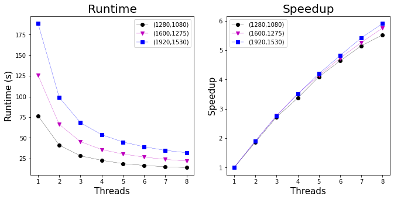
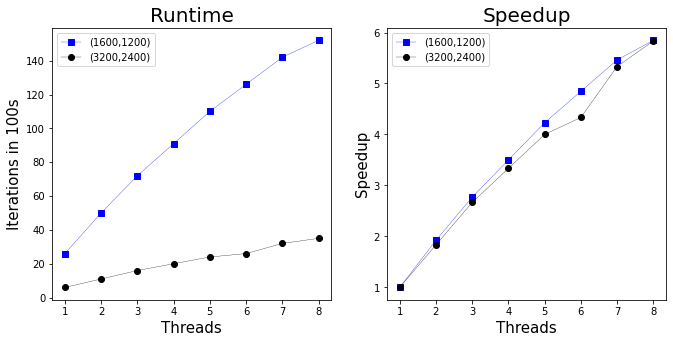
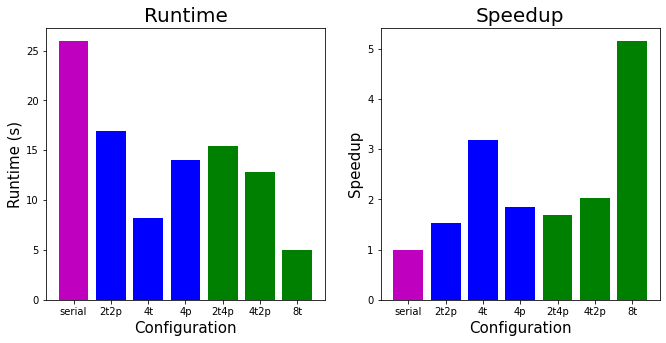
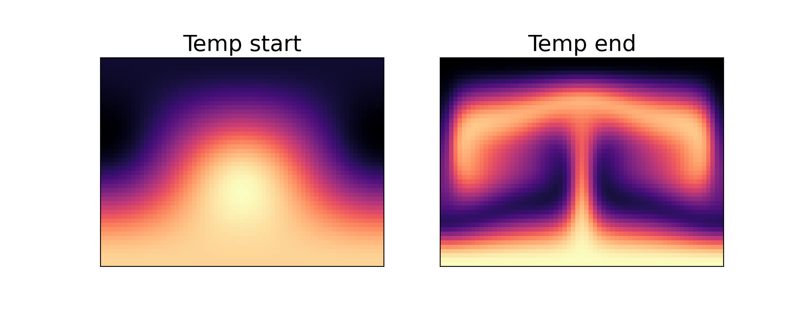
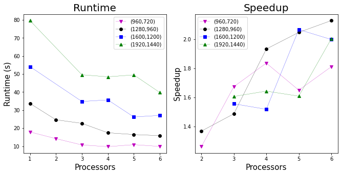
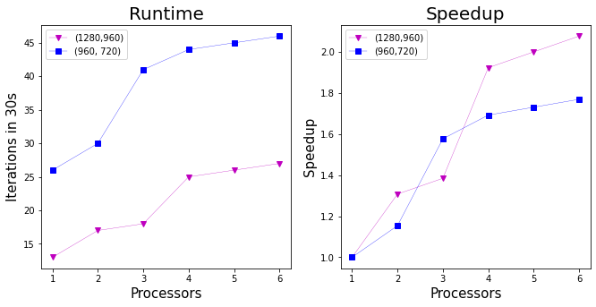

# Examples.

This directory contains a number of examples and test cases for our parallelization of the optRBC code. The examples demonstrate performance results, 
how to visualize the temperature field, and how to calculate the nusselt number. At the very end of this examples README, there is a section with instructions to run [custom configurations](./README.md#running-on-custom-configurations).

Each example will be composed of 3 parts:

1. A shell script to execute.
2. A description in this file of what is happening.
3. A sample output file showing what the standard output of each shell script should look like. 

We strongly recommend that the examples are run on a `t2.2xlarge` instance on AWS with the Ubuntu 18.04 operating system, because these are the results that are presented and documented in the
sample output files. Further replicability information is included in [Section 5.4](../README.md) of the main README. Before we jump in, a few notes:

1. In general we found that the OpenMP results are much easier to replicate and have much more consistent runtimes.
2. We had one strange experience where a `t2.2xlarge` instance with a public ip starting in the 100 range gave very poor performance, even though the hardware specs looked the same. If when spinning up an instance the public IP is in that range, consider relaunching to try to get on that starts in the 30s, e.g., `35.175.132.17` or in the 50s, e.g., `54.236.30.52`.
3. These examples were run in the US East 1 (N. Virginia) region, so we encourage the reader to use that region.
4. We have noticed that the overall performance of the OpenMP code degrades after the MPI versions are run. This is very strange and tough to debug, but for the meantime we encourage the reader to run the examples in the order that they are presented, and keep in mind that once the MPI examples are run, results might be worse than before for OpenMP. Before the MPI versions are run, the OpenMP results should be extremely stable and replicable.


## Prerequisites.

The following steps must be run in order for the examples to work. 

First clone this repository to the AWS instance with 

```
git clone https://github.com/dsondak/optRBC.git
```

Change into the optRBC directory.

```
cd optRBC
```

Checkout the `parallel_project` branch with

```
git checkout parallel_project
```

Run the `aws_setup.sh` script with 

```
./aws_setup.sh
```

This script will require you to hit enter a few times to confirm the packages being added to the instance. 

Once all the packages are installed run 

```
make
```

to build the binary, and 

```
cd examples
```
to enter this directory.

Lastly, run 

```
./install_python.sh
```

to install the required python packages. 

## Contents.

We present the 7 examples below. 

1. OpenMP strong scaling.
2. OpenMP weak scaling. 
3. Hybrid OpenMP + MPI performance.
4. Temperature field visualization.
5. Nusselt number calculation.
6. MPI strong scaling.
7. MPI weak scaling.

The remainder of this document will step through each example to demonstrate how to reproduce the results. 

### 1. OpenMP strong scaling.

This example demonstrates strong scaling according to Amdahl's law for the OpenMP multi-threaded version of the code. The problem size is
fixed to a grid of size Nx=1280 and Ny=1080. With a timestep of 0.1, we iterate for 30 steps and time the entire execution. Since the problem
size is fixed, this is an example of strong scaling. 

To run this example, run the shell script:

```
./run_omp_strong.sh
```

The total runtime of the script with be about 5 minutes on a `t2.2xlarge` instance. The file `sample_omp_strong_results` has an example output from the 
bash script to compare to. Since the linux `time` command is used, we are interested in the `real` reported time. For example, for 8 threads,

```
8 threads running ...

real	0m14.410s
user	1m29.505s
sys	0m0.356s
```
the time we are interested in is the 14.410 seconds. The figure below shows the runtimes and scalings for various problem sizes. The problem size in the 
bash script corresponds to the black circles on the plot below. 



For a discussion on these results, please refer to the main README.

### 2. OpenMP weak scaling.

This example demonstrates weak scaling according to Gustafson's law for the OpenMP multi-threaded version of the code. In order to allow the problem size to 
grow as we increase the number of threads used, we fix the grid size to Nx=1600 and Ny=1200, but allow every version of the code to run for 100 seconds. As a
result, the serial portion of the code (initialization of the matrices) is fixed for each run, and we can measure how much work each version of the code can 
do in a fixed amount of time.

To run this example, run the shell script:

```
./run_omp_weak.sh
```

The total runtime of the script will be 800 seconds (13.3 minutes). The file `sample_omp_weak_results` has an example output from the 
bash script to compare to. There is a lot of output on this example, because we need to see how many iterations each version accomplished. Since each timestep is only 0.01, we can count the number of iterations just by looking at the final time once the next version is run. For example, for the serial version, the output looks like 

```
 Running with            1  threads
 time =    1.0000000000000000E-002 dt =    1.0000000000000000E-002
 time =    2.0000000000000000E-002 dt =    1.0000000000000000E-002
...
 time =   0.25000000000000006      dt =    1.0000000000000000E-002
 time =   0.26000000000000006      dt =    1.0000000000000000E-002
2 threads running ...
```

So in 100 seconds, it was able to do 26 iterations. Now for 2 threads, 

```
Running with            2  threads
 time =    1.0000000000000000E-002 dt =    1.0000000000000000E-002
 time =    2.0000000000000000E-002 dt =    1.0000000000000000E-002
...
 time =   0.48000000000000026      dt =    1.0000000000000000E-002
 time =   0.49000000000000027      dt =    1.0000000000000000E-002
```

49 iterations were completed in 100 seconds. This process can be continued for each of the number of threads run (1-8). This data corresponds to the 
blue squares in the figure below, which plots iteration count and weak scaling speedup for two different problem sizes.



For a discussion on these results, please refer to the main README.

### 3. Hybrid OpenMP + MPI performance.

This example evaluates the performance of the hybrid implementation. The problem size is fixed at Nx=1289 and Ny=960, and is run with a step size of 0.01 for 
10 steps. This script runs 7 different experiments:

1. Serial
2. 2 processors 2 threads
3. 1 processor  4 threads
4. 4 processors 1 thread
5. 2 processors 4 threads
6. 4 processors 2 threads
7. 1 processor  8 threads

Items 2-4 are total of 4 cores, and items 5-7 are a total of 8 cores.

To run this example, run the shell script:

```
./run_hybrid.sh
```

The total runtime of the script with be about 2 minutes on a `t2.2xlarge` instance. The file `sample_hybrid_results` has an example output from the 
bash script to compare to. Again, we are interested in the `real` time.

The figure below shows the runtimes and scalings for each of the 7 configurations described above. 



Note that this hybrid implementation is still running on a singe node, just multiple processes. We tried running it on the AWS cluster, but it didn't work out of the box, and we didn't have enough time to debug the problem. For a discussion on these results, please refer to the main README.

### 4. Temperature field visualization.

This example demonstrates how to visualize the temperature fields produced from the the convection equations. A small grid of Nx=64 and Ny=48 is used and we iterate for 50 steps with a step size of 0.1 and a Rayleigh number of 5.0e+04. We run the shared memory version (OpenMP) as well as the distributed memory version (MPI) to demonstrate how we assert correctness of the MPI code. 

To run this example, run the shell script:

```
./run_temp_viz.sh
```

The file `sample_temp_viz_results` has an example output from the bash script to compare to. This script should complete within about 4 seconds. This will create a directory called `vtkdata` within the `examples` directory. Run 

```
ls vtkdata
```

to confirm that the files were written. The output should look like 

```
Ra000000000.vtk       Ra000000043.vtk       Ra_P000_000000035.vtk Ra_P001_000000027.vtk Ra_P002_000000019.vtk Ra_P003_000000011.vtk
Ra000000001.vtk       Ra000000044.vtk       Ra_P000_000000036.vtk Ra_P001_000000028.vtk Ra_P002_000000020.vtk Ra_P003_000000012.vtk
Ra000000002.vtk       Ra000000045.vtk       Ra_P000_000000037.vtk Ra_P001_000000029.vtk Ra_P002_000000021.vtk Ra_P003_000000013.vtk
```

The `Ra#########.vtk` files are from the single core version and are full size (48x64), which the `Ra_P###_##########.vtk` files are from the distributed memory
version. To visualize the data, run the python script with

```
python3 temp_viz.py
```

This will first plot the temperature at the beginning of the integration as well as at the end. The file will be written as `single.png`, which is shown below.



This file can be retrieved from the AWS instance with the following `scp` command in a new terminal on your local machine

```
scp -i ~/.ssh/<YOUR KEY PAIR> ubuntu@<THE IP OF YOUR INSTANCE>:/home/ubuntu/optRBC/examples/single.png single.png
```

where the key-pair and ip of the AWS instance need to be filled in. 

`single.png` shows the temperature field at time t=0 and at t=5 for the single core version of the code. The python script will also write a file called `multi.png`, which is shown below.


This file can be retrieved from the AWS instance with the following `scp` command in a a new terminal on your local machine

```
scp -i ~/.ssh/<YOUR KEY PAIR> ubuntu@<THE IP OF YOUR INSTANCE>:/home/ubuntu/optRBC/examples/multi.png multi.png
```
`multi.png` shows the temperature field at time t=0 and at t=5 for the four-core version of the code.
This plot demonstrates that the temperature field is correctly divided along the y-direction. Lastly, the script will output 

```
0.0 0.0
0.0 0.0
0.0 0.0
0.0 0.0
```

which confirms that the two temperature fields are identical (because it is printing the difference between the component parts of the fields). This is how we ensure correctness of the MPI version of the code. Also see this notebook [temp_viz.ipynb](./temp_viz.ipynb) for more details about how to plot and visualize the temperature fields.

### 5. Nusselt number calculation.

The Nusselt number is a measure of the heat transfer within the system. This is the variable of interest in most contexts, and how we assert correctness of the 
code as we make changes. To demonstrate calculation and plotting of the Nusselt number, we use a small grid of Nx=64 and Ny=48. We iterate for 1000 steps with a 
time step of 0.1 for three different Rayleigh numbers, (1) 5.0e+02, (2) 5.0e+03, (3) 5.0e+04. We use different Rayleigh numbers to show different Nusselt numbers
evolving over time. 

To run this example, run the shell script:

```
./run_nusselt.sh
```

This will print out a ton of output, but should take fewer than 10 seconds. This script will write 3 new files. Confirm that they are present by running

```
ls nu*.txt
```

which should output

```
nu1.txt nu2.txt nu3.txt
```

To plot these time series, run the following python script, 

```
python3 nusselt.py
```

which will write the `nusselt.png` figure to this directory. This figure is shown below.


This file can be retrieved from the AWS instance with the following `scp` command in a new terminal on your local machine

```
scp -i ~/.ssh/<YOUR KEY PAIR> ubuntu@<THE IP OF YOUR INSTANCE>:/home/ubuntu/optRBC/examples/nusselt.png nusselt.png
```

Comparing the Nusselt numbers is how we ensure correctness of the code. Also see this notebook [nusselt.ipynb](./nusselt.ipynb) for more details about how to plot and visualize the nusselt numbers.

### 6. MPI strong scaling.

*NOTE*: From this example onward, the performance results are much harder to replicate in our experience, and we have found that running these examples degrades the performance of the machine overall. We aren't sure what exactly could be causing this, but in the meantime this is just a heads up!

This example demonstrates strong scaling according to Amdahl's law for the MPI multi-process version of the code. The problem size is
fixed to a grid of size Nx=1280 and Ny=960. With a timestep of 0.1, we iterate for 10 steps and time the entire execution. Since the problem
size is fixed, this is an example of strong scaling. 

To run this example, run the shell script:

```
./run_mpi_strong.sh
```

The total runtime of the script with be about 2 minutes on a `t2.2xlarge` instance. The file `sample_mpi_strong_results` has an example output from the 
bash script to compare to. 

The figure below shows the runtimes and scalings for various problem sizes. The problem size in the 
bash script corresponds to the black circles on the plot below. 



For a discussion on these results, please refer to the main README.

### 7. MPI weak scaling.

This example demonstrates weak scaling according to Gustafson's law for the MPI multi-process version of the code. In order to allow the problem size to 
grow as we increase the number of threads used, we fix the grid size to Nx=1280 and Ny=960, but allow every version of the code to run for 30 seconds. As a
result, the serial portion of the code (initialization of the matrices) is fixed for each run, and we can measure how much work each version of the code can 
do in a fixed amount of time.

To run this example, run the shell script:

```
./run_mpi_weak.sh
```

The total runtime of the script will be 240 seconds (4 minutes). The file `sample_mpi_weak_results` has an example output from the 
bash script to compare to. We use the same technique as Example 2 to read the output.

This data corresponds to the magenta triangles in the figure below, which plots iteration count and weak scaling speedup for two different problem sizes.



For a discussion on these results, please refer to the main README.


## Running on custom configurations.

All of the examples above use predefined input files to ensure replicability of the results, and make it as easy as possible to run our code. It is also possible to run the code with a custom
input file if the reader would like greater flexibility. In general, the input configuration is quite specific and there are many steps to ensure a correct output. Read the following carefully! At the end of this document we also include the input files used in the above examples for reference. First make and copy the `time_loop.exe` and `time_loop_MPI.exe` files in this directory with 
following commands

```
cd ..
make
cp time_loop.exe ./examples/
cp time_loop_MPI.exe ./examples/
cd examples/
```

In order for the `time_loop.exe` executable to run, there needs to be a file called `input.data` that specifies the configuration of the time integration. The structure of the file is shown below.

### Input File Structure
| Line #   | Column 1      | Column 2                  | Column 3                          |
| :------: | :--------:    | :--------:                | :--------:                        |
| 1        | $Pr$          | Initial $\alpha$          | $\alpha$ step                     |
| 2        | Initial $Ra$  | # of $Ra$s to do          | $Ra$ increment multiplier         |
| 3        | Flow map time | Time step                 | Leave blank                       |
| 4        | $y$ at bottom | $y$ at top                | Leave blank                       |
| 5        | Nx            | Ny                        | Nz                                |
| 6        | x-refinement  | y-refinement              | z-refinement                      |
| 7        | Save to VTK   | Save binary restart files | Calculate the nusselt number |

An example of this file is 

```
7.0, 1.5585, 0.1
5.0e+03, 1, 1.1
0.1, 0.01
-1.0, 1.0
1280, 960, 1
0, 0, 0
0, 0, 0
```

For this code, the only values that should be modified are

* Initial $Ra$ (row=2, col=1)
* Flow map time (row=3, col=1)
* Time step (row=3, col=2)
* Nx (row=5, col=1)
* Ny (row=5, col=2)
* Save to VTK (row=7, col=1)
* Calculate the nusselt number (row=7, col=3).

All of the other values should be set to match the example above, e.g.,
```
7.0, 1.5585, 0.1
#, 1, 1.1
#, #
-1.0, 1.0
#, #, 1
0, 0, 0
#, 0, #
```

where the `#` denotes a user specified input. Generally speaking, higher Rayleigh numbers require a finer grid (meaning larger values of Nx and Ny) and a smaller timestep. One easy way to confirm that a configuration works, is to flip on the nusselt number calculation flag (row=7,col=3), and confirm that the nusselt number does
not become a NaN. The performance of the code will change dramatically when turning on the Save to vtk flag (row=7,col=1), and outputs will be written to the `vtkdata/` directory that is created where ever the executable is being run. If the nusselt number calculation flag is set (row=7,col=3), then the nusselt number will be 
written at each time step, and also will be written to a file called `Nu_data.txt`, which will also be created in the directory that the executable is running in.
The vtkdata can be viewed in a few ways. The easiest is to use [paraview](https://www.paraview.org/), which is an open source visualization tool. Alternatively, the data can be read into python using the [meshio](https://github.com/nschloe/meshio) library. See [temp_viz.py](./temp_viz.py) in this directory for an example of how to load the data. 

### Running OpenMP and MPI

To run the OpenMP version of the code, simply run the `./time_loop.exe` after specifying the number of threads desired using the environment variable,

```
export OMP_NUM_THREADS=4
./time_loop.exe
```

After printing out the configuration, it should print out the correct number of threads being run, 

```
Running with            4  threads
```

To run the MPI version of the code, first export the following environment variable

```
export OMPI_MCA_btl=^openib
```

Then use `mpirun` to launch the executable,

```
mpirun -np 2 ./time_loop_MPI.exe
```

After printing out the configuration, it should describe how the problem has been divided,

```
 Ny =          960  divided among            2  processors ->          480  rows per processor.
 processor            1 initialized with          480 rows.
 processor            0 initialized with          480 rows.
```

NOTE: In order for the MPI version to be correct, the value of `Ny` must be divisible by the number of processors used!! This was a design decision, as handling the case of unequal distribution would add large amounts of code complexity, and not that much functionality. 


### Example input.data files

To conclude we present the input.data files we used for each of the 7 examples above. 

#### Example 1

```
7.0, 1.5585, 0.1
5.0e+03, 1, 1.1
3.0, 0.1
-1.0, 1.0
1280, 1080, 1
0, 0, 0
0, 0, 0
```

This file specifies a medium size grid with Nx=1280 and Ny=1080. We will iterate until 3s with a step size of 0.1, so 30 total steps. We use our standard Ra number of 5.0e+03. Both vtk and nusselt writing are off. 


#### Example 2

```
7.0, 1.5585, 0.1
5.0e+03, 1, 1.1
100., 0.01
-1.0, 1.0
1600, 1200, 1
0, 0, 0
0, 0, 0
```

This file specifies a medium size grid with Nx=1600 and Ny=1200. We will iterate until 100s with a step size of 0.01. Since this is the weak scaling example, we want a long iteration, and we will just cut it off early. We use our standard Ra number of 5.0e+03. Both vtk and nusselt writing are off. 


#### Example 3

```
7.0, 1.5585, 0.1
5.0e+03, 1, 1.1
0.1, 0.01
-1.0, 1.0
1280, 960, 1
0, 0, 0
0, 0, 0
```

This file specifies a medium size grid with Nx=1280 and Ny=960. We will iterate until 0.1s with a step size of 0.01, so just 10 steps. We use our standard Ra number of 5.0e+03. Both vtk and nusselt writing are off.


#### Example 4

```
7.0, 1.5585, 0.1
5.0e+04, 1, 1.1
5.0, 0.1
-1.0, 1.0
64, 48, 1
0, 0, 0
1, 0, 0
```

This file specifies a small grid with Nx=64 and Ny=48. We will iterate until 5s with a step size of 0.1, so 50 steps. We use a larger Ra number of 5.0e+04 to get more interesting temperature profiles. Vtk writing is turned on. Nusselt writing is off.


#### Example 5

We use three input files for this example, to show a variety of nusselt numbers. All 3 of the files are identical, except they differ in the Ra number. 

First file with Ra number = 5.0e+04
```
7.0, 1.5585, 0.1
5.0e+04, 1, 1.1
100.0, 0.1
-1.0, 1.0
64, 48, 1
0, 0, 0
0, 0, 1
```

Second file with Ra number = 5.0e+03
```
7.0, 1.5585, 0.1
5.0e+03, 1, 1.1
100.0, 0.1
-1.0, 1.0
64, 48, 1
0, 0, 0
0, 0, 1
```

Third file with Ra number = 5.0e+02
```
7.0, 1.5585, 0.1
5.0e+02, 1, 1.1
100.0, 0.1
-1.0, 1.0
64, 48, 1
0, 0, 0
0, 0, 1
```

This file specifies a small grid with Nx=64 and Ny=48. We will iterate until 100s with a step size of 0.1, so 1000 steps. Vtk writing is turned off. Nusselt writing is on.

#### Example 6

```
7.0, 1.5585, 0.1
5.0e+03, 1, 1.1
0.1, 0.01
-1.0, 1.0
1280, 960, 1
0, 0, 0
0, 0, 0
```


This file specifies a medium size grid with Nx=1280 and Ny=960. We will iterate until 0.1s with a step size of 0.01, so 10 total steps. We use our standard Ra number of 5.0e+03. Both vtk and nusselt writing are off. 


#### Example 7

```
7.0, 1.5585, 0.1
5.0e+03, 1, 1.1
100., 0.01
-1.0, 1.0
1280, 960, 1
0, 0, 0
0, 0, 0
```

This file specifies a medium size grid with Nx=1280 and Ny=960. We will iterate until 100s with a step size of 0.01. Since this is the weak scaling example, we want a long iteration, and we will just cut it off early. We use our standard Ra number of 5.0e+03. Both vtk and nusselt writing are off. 


