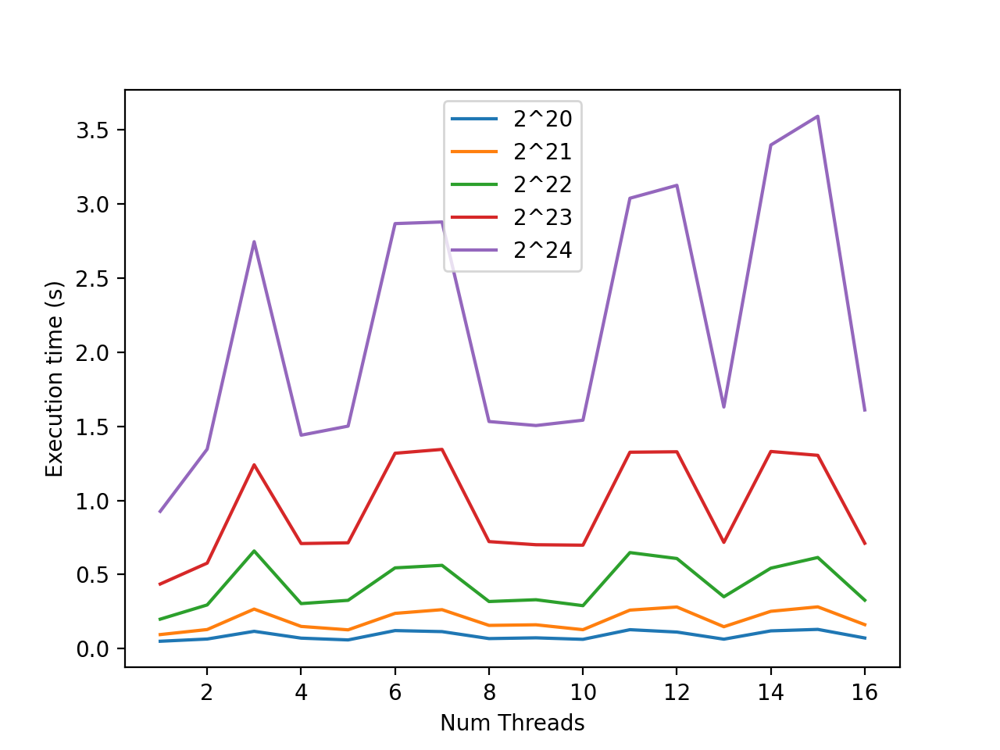
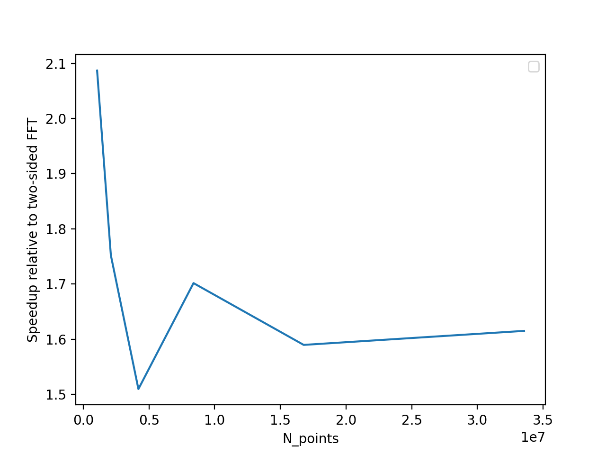

# FFT Examples.

This is a subset of the examples that correspond solely to FFT based experiments. Similar to the entire examples set, for each example there is:

1. A shell script to execute.
2. A description in this file of what is happening.

As in the general examples README, we recommend using a t2.2xlarge AWS instance to replicate results. 

## Prerequisites
 
First clone this repository to the AWS instance with 

```
git clone https://github.com/dsondak/optRBC.git
```

Change into the optRBC directory.

```
cd optRBC
```

Checkout the `parallel_project` branch with

```
git checkout parallel_project
```

Run the `aws_setup.sh` script with 

```
./aws_setup.sh
```

## Contents.

FFT examples consists of: 

1. Multithreaded FFT benchmarking.
2. One-sided FFT benchmarking. 

## 1. Multithreaded FFT

To run and visualize using python, run: 
```
./run_multithread_fft.sh
```
This script takes about 2 minutes to run. This iterates over various array sizes and thread counts, with thread counts ranging from 1 to 16, and executes a discrete fourier transform. The times how long it takes to execute the dft as a function of array size and thread count when planned. 

To bring the plot back to the local machine use the command 

```
scp -i <YOUR KEY PAIR> ubuntu@<PUBLIC IP OF INSTANCE>:/home/ubuntu/optRBC/examples/fft_examples/multithread.png multithread.png
```

When run on a local machine with a 2.6 GHz Intel Core i5 processor (2 cores, 4 threads) the performance of the multithreaded FFT was as follows: 



Though there is some periodicity in the performance with respect to thread count, there is an overall increase in total execution time as we move to larger thread counts. This reduction in performance then motivates single threaded FFT, in particular because using multithreaded FFT makes OpenMP integration more complex. 

## 2. One-sided FFT

To run and visualize using python, run: 
```
./run_fft_one_side.sh
```
This script takes about 2 minutes to run. This iterates over various array sizes and compares the execution time of one-sided vs. two-sided forward and backward transformations, with execution times averaged over 5 runs. 

When run on a local machine with a 2.6 GHz Intel Core i5 processor (2 cores, 4 threads) the performance of the one-sided FFT relative to two-sided FFT was as follows: 




To bring the plot back to the local machine use the command 

```
scp -i <YOUR KEY PAIR> ubuntu@<PUBLIC IP OF INSTANCE>:/home/ubuntu/optRBC/examples/fft_examples/onesided.png onesided.png
```

Even over a large set of array sizes, the speedup for one-sided FFT hovers at roughly 1.6x. At smaller array sizes (closer to the sizes being used) the speedup is closer to the theoretical value of 2x. 
